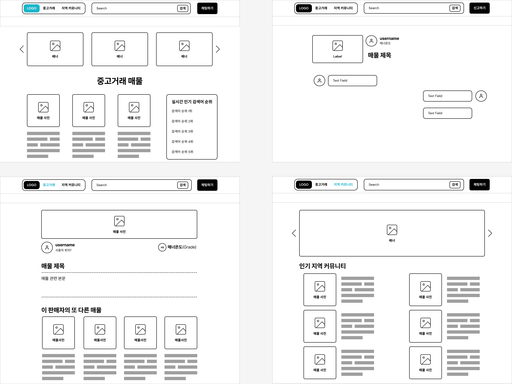

배포 사이트 주소: https://semipjt1.herokuapp.com/
## Semi Project 01

- **기간**: 2022.10.31 ~ 2022.11.07
- **팀명**: 중고의 집
- **주제**: 상품 정보 및 후기 공유 커뮤니티 서비스

### 📌 맡은 역할

- 이용환 채팅, 전반적인 BE, 발표

### 📌 생긴 오류 및 해결

- django-imoji-picker 앱을 사용하여 채팅에서 이모지 전송을 구현하고 싶었으나, 앱을 사용하려면 React와 연동해야 사용가능 할 것 같아서 서버 static 폴더에 이미지를 저장 한 뒤 이미지 박스가 클릭이 될 경우 해당 이미지의 static 파일명 상대에게 javascript를 통하여 비동기로 전송하도록 구현. static/js/chat.js  
Message DB 에는 파일명만 저장이 되고, 화면에 노출시엔 load static을 활용하여 화면에 노출

### 📌 서비스 주요 기능

---

- 회원관리
  - 회원가입
  - 로그인
  - 로그아웃
  - 회원 프로필
  - 팔로우 / 취소
  - 블랙리스트
- 지역 커뮤니티
  - 이미지 업로드
  - 글 수정 / 삭제
  - 좋아요 / 취소
  - 댓글 작성 / 수정 / 삭제 / 신고
  - 대댓글 작성 / 수정 / 삭제 / 신고
- 상품
  - 이미지 업로드
  - 글 수정 / 삭제
  - 좋아요 / 취소
  - 판매 위치 또는 택배 거래 유무
  - 판매자가 파는 다른 상품 소개
  - 매너온도
- 채팅
  - 1:1 대화 구현
  - 이모티콘 전송 
- 검색
  - 인기 검색어 순위
- 문의하기
  - 문의 제목
  - 문의 글
  - 사진 업로드 (선택)
  - 자주 묻는 질문 (후순위)

### 📌 화면 설계

---

### 📌DB 모델링

---

